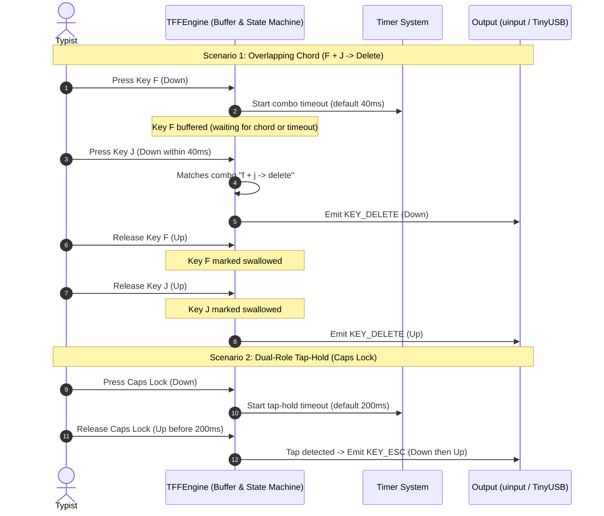

# TFF-like Keyboard Remapping System

A cross-platform keyboard remapping solution that allows overlapping key combinations for enhanced productivity. Inspired by the Ten Flying Fingers (TFF) project but implemented in C++ for better performance and lower latency.

## Features

- **Overlapping Key Detection**: Detect combinations like F+J vs J+F to trigger different actions
- **Cross-Platform**: Runs on both Linux and RP2040 hardware
- **Configurable Mappings**: Custom key combinations defined in configuration files
- **Low Latency**: Optimized for real-time keyboard processing
- **Hardware Agnostic Core**: Same logic runs on multiple platforms
- **Fast Unit Tests**: Core functionality can be tested without hardware

## How It Works

1. **Key Capture**: Reads input from connected keyboards
2. **Overlap Detection**: Identifies when keys are pressed within configurable time windows
3. **Mapping Lookup**: Translates detected combinations to output key sequences
4. **Key Output**: Sends mapped keys to the host computer

### Example Combinations

- Press F and J together (F+J) → Outputs "1"
- Press J and F together (J+F) → Outputs "2"  
- Press F and Space together → Saves document (Ctrl+S)
- Press J and Space together → Undoes last action (Ctrl+Z)

## Architecture & Data Flow

### Dual-Platform Pipeline

```mermaid
flowchart TD
    subgraph Linux ["Linux Platform (tff / tff_linux)"]
        K1["Physical Keyboard"] -->|"/dev/input/event*"| INOTIFY["Inotify Hotplug & Evdev Reader"]
        INOTIFY -->|EVIOCGRAB| ENGINE_L["TFFEngine Core State Machine"]
        ENGINE_L -->|Virtual Events| UINPUT["/dev/uinput Device"]
        UINPUT --> APPS["Desktop Applications (Wayland / X11)"]
    end

    subgraph Hardware ["RP2040 Hardware Platform"]
        K2["Physical USB Keyboard"] -->|USB-A Host| HOST["TinyUSB Host (MAX3421E / Native)"]
        HOST -->|Raw Keycodes| CONV["RP2040Platform Key Translator"]
        CONV --> ENGINE_HW["TFFEngine Core State Machine"]
        ENGINE_HW -->|USB HID Reports| DEV["TinyUSB Device"]
        DEV -->|USB-C Cable| PC["Host Computer (BIOS, Windows, Mac, Linux)"]
    end
```



### Chord Resolution & Timing Model



## Platforms

### Linux Version
- **Input**: Reads physical keyboard events via evdev (`/dev/input/event*`) with optional exclusive grab (`ioctl(fd, EVIOCGRAB, 1)`)
- **Output**: Emits remapped virtual keyboard events via uinput (`/dev/uinput`)
- **Core**: 100% shared `tff::TFFEngine` matching the Go `tff` state machine and CircuitPython RP2040 firmware
- **CLI Daemon**: `tff` (or `tff_linux`) supports auto-discovery, custom YAML configs, multi-keyboard polling, and graceful signal handling
- **Systemd Service**: Runs in the background with auto-restart and highest CPU priority (`Nice=-20`)

```bash
# Install via mise (recommended for developers / user-level management):
mise use -g github:guettli/tff2
# or using ubi backend:
mise use -g ubi:guettli/tff2

# Or install from source repository:
sudo ./install.sh          # System-wide (/usr/local/bin)
./install.sh --user        # User-level (~/.local/bin)

# List discovered keyboards and persistent symlinks:
tff --list

# View terminal cheat sheet or markdown table of your mappings:
tff cheatsheet
tff cheatsheet --markdown

# Live event monitor and chord debugger:
tff monitor                       # Inspect live keypresses, timing deltas, and chord candidate matching
tff monitor --plain               # Disable ANSI colors
tff monitor /dev/input/eventX     # Monitor a specific input device

# Validate non-root permissions or install udev rules:
tff setup-udev                      # Check permissions and print diagnostics
sudo tff setup-udev --install       # Install udev rules and reload udevadm
tff setup-udev --print              # Print udev rules to stdout

# Validate combo configuration:
tff validate /etc/tff/tff-combos.yaml

# Manage the background service:
sudo systemctl status ten-flying-fingers
sudo journalctl -u ten-flying-fingers -f
```

See [Linux Installation & Systemd Guide](docs/install.md) for mise usage, systemd user services, and [Systemd Service Example](ten-flying-fingers.service.example).

### RP2040 Version  
- **Input**: USB host port reads from connected keyboard
- **Output**: USB device port presents as keyboard to computer
- **Development**: Cross-compilation required

## Configuration

Define custom key mappings in YAML format matching standard TFF combos. See [configuration documentation](docs/configuration.md) for detailed information.

```yaml
combos:
  # Home row index finger combos
  - keys: j f
    outKeys: backspace

  - keys: f j
    outKeys: delete

  # Navigation combos with F
  - keys: f n
    outKeys: down

  - keys: f u
    outKeys: up

  - keys: f k
    outKeys: left

  - keys: f l
    outKeys: right
```

Configurations are loaded natively by `tff::loadYamlCombos` and can be validated using the CLI tool:
```bash
tff validate config/tff-combos.yaml
```

The default configuration file is located at [config/tff-combos.yaml](config/tff-combos.yaml).

## Building

### Prerequisites

See [docs/local_dev.md](docs/local_dev.md) for detailed setup instructions.

### Linux Build

```bash
mkdir build-linux
cd build-linux
cmake ..
make
```

### RP2040 Build

Requires Raspberry Pi Pico SDK:

```bash
# Set up environment
export PICO_SDK_PATH=/path/to/pico-sdk

# Use provided build script
./build_rp2040.sh

# Or build manually:
mkdir build-rp2040
cd build-rp2040
cmake .. -DPICO_BUILD=ON
make
```

The firmware will be generated as a UF2 file that can be flashed to the RP2040 by copying it to the device when in bootloader mode.

## Testing

### Unit Tests (Hardware-Independent C++)

Run all native unit tests (including the full Go-parity test suite running in ~0.02s without requiring RP2040 or special privileges):

```bash
./build.sh
```

Or run the ported Go unit test suite directly:

```bash
./build/test_tff_go_suite
```

### Pre-Push Verification & Invariant Testing

Run the comprehensive pre-push quality check covering code formatting, strict `-Werror` build, 16 CTest unit test suites (including property-based invariant verification and 5,000-cycle fuzzing), Cppcheck static analysis, and CLI smoke tests:

```bash
./scripts/check.sh             # Full quality verification pipeline
./scripts/check.sh --coverage  # Also generates gcov line coverage report
./scripts/check.sh --all       # Runs everything including ASan/UBSan and coverage
```

### Automated Hardware Testing (USB-OTG Loop)

End-to-end hardware testing can be run using the UpBoard's micro-USB OTG port connected to the RP2040 USB-A host port:

```bash
./test_tff_automated.sh
```

See [docs/hardware_testing.md](docs/hardware_testing.md) for full architectural details and test cases.

## Hardware Setup

### RP2040 Wiring

1. Connect keyboard to USB-A host port
2. Connect RP2040 USB-C to computer
3. System appears as standard USB keyboard to computer

## Documentation & Manual

- **System Architecture**: Detailed event processing sequence diagrams and invariants in [`docs/architecture.md`](docs/architecture.md)
- **C++ Core API Reference**: Complete engine API and struct documentation in [`docs/api.md`](docs/api.md)
- **Unix Manual Page**: Run `man tff` (or see [`docs/man/tff.1`](docs/man/tff.1))
- **Configuration Guide**: [`docs/configuration.md`](docs/configuration.md)
- **Configuration Cookbook**: [`docs/cookbook.md`](docs/cookbook.md)
- **Troubleshooting & Diagnostics**: [`docs/troubleshooting.md`](docs/troubleshooting.md)
- **Linux Installation & Systemd**: [`docs/install.md`](docs/install.md)
- **Shell Autocompletions**: Bash, Zsh, and Fish completions in [`completions/`](completions/) (installed automatically via [`install.sh`](install.sh))
- **Local Development Guide**: [`docs/local_dev.md`](docs/local_dev.md)
- **RP2040 Implementation**: [`docs/rp2040_implementation.md`](docs/rp2040_implementation.md)
- **Automated Hardware Testing**: [`docs/hardware_testing.md`](docs/hardware_testing.md)

## Contributing

We welcome contributions! Please see [`CONTRIBUTING.md`](CONTRIBUTING.md) for guidelines on branch naming, code formatting (`clang-format`), and pre-push verification with `./scripts/check.sh`.