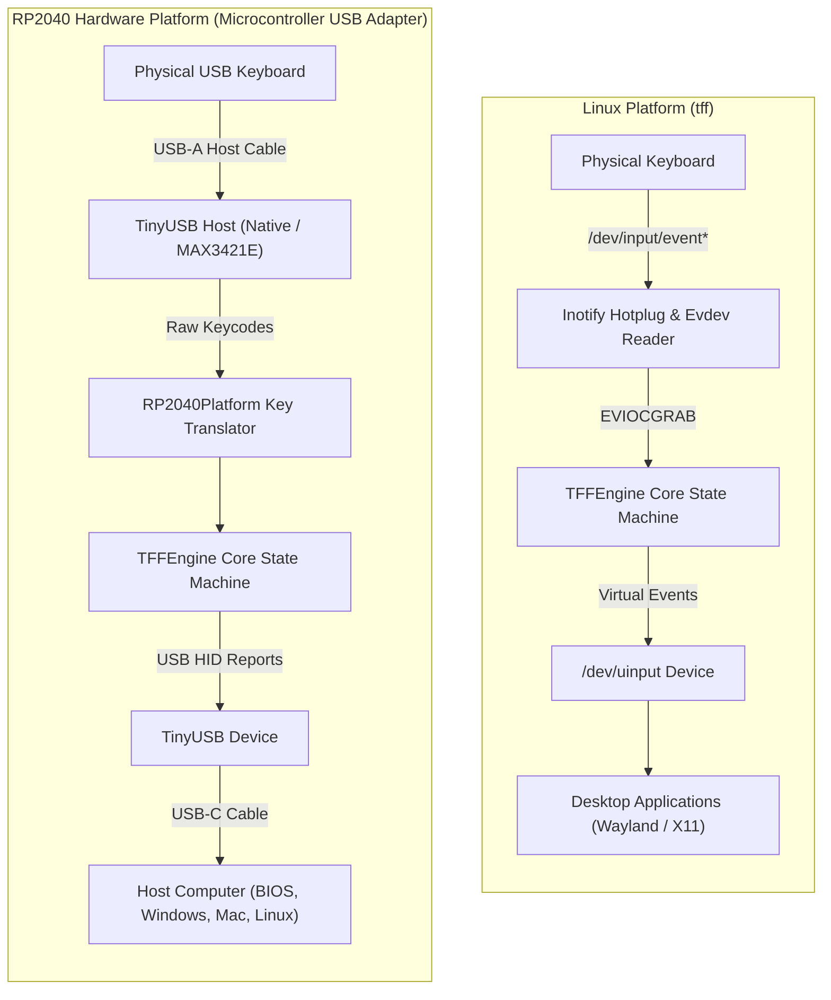
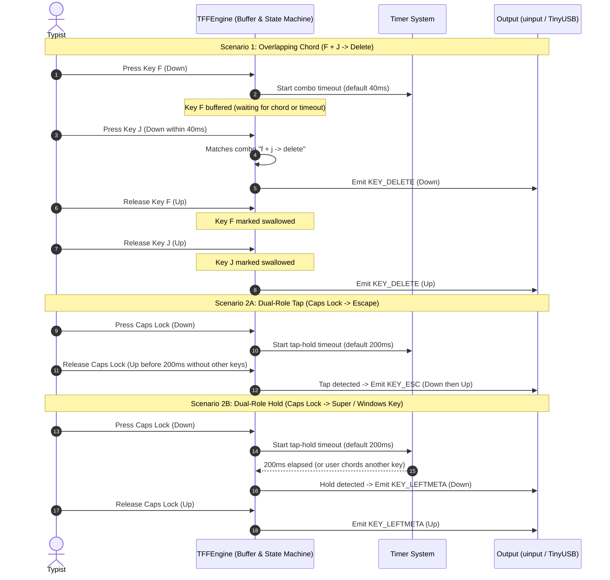

# TFF-like Keyboard Remapping System

A cross-platform keyboard remapping solution that allows overlapping key combinations for enhanced productivity. Inspired by the Ten Flying Fingers (TFF) project, implemented in C++ to run both as a native Linux background daemon and directly on RP2040 hardware USB adapters without host software.

### Overall Goal

Keep your fingers on the home row! Stretching fingers to reach distant keys like Backspace, Delete, Escape, or arrow keys disrupts typing flow and strains hands. TFF lets you trigger these actions using fast, natural overlapping chords and dual-role keys directly on the home row (e.g. `J` + `F` for Backspace, `F` + `J` for Delete, or holding `Caps Lock` for Super while tapping for Escape).

## Features

- **Overlapping Key Detection**: Detect combinations like F+J vs J+F to trigger different actions
- **Cross-Platform**: Runs on both Linux and RP2040 hardware
- **Configurable Mappings**: Custom key combinations defined in configuration files
- **Low Latency**: Optimized for real-time keyboard processing
- **Hardware Agnostic Core**: Same logic runs on multiple platforms
- **Fast Unit Tests**: Core functionality can be tested without hardware

## How It Works

1. **Key Capture**: Reads input from connected keyboards
2. **Overlap Detection**: Identifies when keys are pressed within configurable time windows
3. **Mapping Lookup**: Translates detected combinations to output key sequences
4. **Key Output**: Sends mapped keys to the host computer

### Example Combinations

- Press F and J together (F+J) → Outputs "1"
- Press J and F together (J+F) → Outputs "2"  
- Press F and Space together → Saves document (Ctrl+S)
- Press J and Space together → Undoes last action (Ctrl+Z)

## Architecture & Data Flow

### Dual-Platform Pipeline



### Chord Resolution & Timing Model



**How Dual-Role Tap-Hold Works**: Keys like Caps Lock can perform two distinct roles without any mode switching:
- **Tapping** (pressing and releasing within 200ms without pressing another key) emits a standard keypress like `Escape`.
- **Holding** (holding longer than 200ms, or pressing another key while holding) transforms the key into a modifier like `Super` (Windows/Cmd) or `Ctrl`.
This completely eliminates awkward hand stretching for modifier keys.

### Emergency State Machine Reset
If you ever find yourself locked in an unexpected modal layer or state loop, simply **press and hold Escape (`ESC`) continuously for 3.0 seconds**.
TFF will automatically trigger an emergency state machine reset: clearing all active and toggle layers, releasing any held tap-hold or one-shot modifiers, clearing leader sequences and buffers, and cleanly swallowing the `ESC` release event. This safeguard is always active by default without needing configuration.

## Platforms

### Linux Version
- **Input**: Reads physical keyboard events via evdev (`/dev/input/event*`) with optional exclusive grab (`ioctl(fd, EVIOCGRAB, 1)`)
- **Output**: Emits remapped virtual keyboard events via uinput (`/dev/uinput`)
- **Core**: 100% shared `tff::TFFEngine` running identically across Linux and embedded microcontroller firmware
- **CLI Daemon**: `tff` supports auto-discovery, custom YAML configs, multi-keyboard polling, and graceful signal handling
- **Systemd Service**: Runs in the background with auto-restart and highest CPU priority (`Nice=-20`)

```bash
# Install official Debian / Ubuntu package:
sudo apt install ./tff2_amd64.deb
# Or via dpkg:
sudo dpkg -i tff2_amd64.deb

# Quick installation via curl:
curl -fsSL https://raw.githubusercontent.com/guettli/tff2/main/install.sh | sudo bash

# Or install via mise (recommended for user-level management):
mise use -g github:guettli/tff2

# Or install from source repository:
sudo ./install.sh          # System-wide (/usr/local/bin)
./install.sh --user        # User-level (~/.local/bin)

# List discovered keyboards and persistent symlinks:
tff --list

# Interactive configuration wizard or instant preset generator:
tff init                          # Interactive step-by-step interview
tff init --list-presets           # List presets (minimal, vim-nav, home-row-mods, full)
tff init --preset vim-nav         # Install vim navigation layer preset
tff init --preset minimal --print # Preview generated YAML configuration

# View terminal cheat sheet or markdown table of your mappings:
tff cheatsheet
tff cheatsheet --markdown

# Live event monitor and chord debugger:
tff monitor                       # Inspect live keypresses, timing deltas, and chord candidate matching
tff monitor --plain               # Disable ANSI colors
tff monitor /dev/input/eventX     # Monitor a specific input device

# Validate non-root permissions or install udev rules:
# (Udev rules grant your user account access to read physical keyboards and emit virtual keys via /dev/uinput without sudo)
tff setup-udev                      # Check permissions and print diagnostics
sudo tff setup-udev --install       # Install udev rules and reload udevadm
tff setup-udev --print              # Print udev rules to stdout

# Validate combo configuration:
tff validate /etc/tff/tff-combos.yaml

# Manage the background service:
sudo systemctl status ten-flying-fingers
sudo journalctl -u ten-flying-fingers -f
```

See [Linux Installation & Systemd Guide](docs/install.md) for mise usage, systemd user services, and [Systemd Service Example](ten-flying-fingers.service.example).

### RP2040 Firmware (Microcontroller Mode)

The Raspberry Pi RP2040 is an inexpensive 32-bit dual ARM Cortex-M0+ microcontroller. When flashed with Ten Flying Fingers on a board equipped with a USB Host port (such as the Adafruit Feather RP2040 USB Host), it functions as a standalone hardware keyboard adapter that sits between your physical keyboard and your computer.

- **Zero Host Software**: Runs 100% on the microcontroller. Requires zero drivers, background services, or administrative rights on the host computer.
- **Universal Compatibility**: Works seamlessly in BIOS/UEFI setup screens, on corporate-restricted laptops, Apple macOS, Microsoft Windows, Linux, and iPad/tablets.
- **Input**: Reads physical keyboard reports via USB Host (TinyUSB Host).
- **Output**: Emits remapped keystrokes, combos, and layers as a standard USB HID keyboard (TinyUSB Device).
- **Pre-Built UF2**: Download pre-compiled `tff_rp2040.uf2` directly from [GitHub Releases](https://github.com/guettli/tff2/releases) and flash via drag-and-drop BOOTSEL mode.
- See the [RP2040 Implementation Guide](docs/rp2040_implementation.md) for full hardware setup, wiring, and flashing steps.

## Configuration

Define custom key mappings in YAML format matching standard TFF combos. See [configuration documentation](docs/configuration.md) for detailed information.

```yaml
combos:
  # Home row index finger combos
  - keys: j f
    outKeys: backspace

  - keys: f j
    outKeys: delete

  # Navigation combos with F
  - keys: f n
    outKeys: down

  - keys: f u
    outKeys: up

  - keys: f k
    outKeys: left

  - keys: f l
    outKeys: right
```

Configurations are loaded natively by `tff::loadYamlCombos` and can be validated using the CLI tool:
```bash
tff validate config/tff-combos.yaml
```

The default configuration file is located at [config/tff-combos.yaml](config/tff-combos.yaml).

## Building

### Prerequisites

See [docs/local_dev.md](docs/local_dev.md) for detailed setup instructions.

### Linux Build

```bash
mkdir build-linux
cd build-linux
cmake ..
make
```

### RP2040 Build

Ten Flying Fingers provides an automated cross-compilation script (`./build_rp2040.sh`) that checks the ARM toolchain, automatically fetches Pico SDK v2.1.1 and TinyUSB (if not already installed), and compiles `tff_rp2040.uf2`:

```bash
# Automated cross-compilation:
./build_rp2040.sh

# Or compile for a specific board:
PICO_BOARD=pico ./build_rp2040.sh
```

**Flashing via BOOTSEL**:
1. Hold down the **BOOTSEL** button on your RP2040 board while connecting USB-C to your computer.
2. Drag and drop `build-rp2040/tff_rp2040.uf2` onto the mounted `RPI-RP2` drive.
3. The board flashes automatically, unmounts, and boots running Ten Flying Fingers.

See the [RP2040 Implementation Guide](docs/rp2040_implementation.md) for SWD debugging and manual CMake options.

## Testing

### Unit Tests (Hardware-Independent C++)

Run all native unit tests (running all 19 test suites in ~0.02s without requiring special privileges or hardware):

```bash
./build.sh
```

### Pre-Push Verification & Invariant Testing

Run the comprehensive pre-push quality check covering code formatting, strict `-Werror` build, 19 CTest unit test suites (including property-based invariant verification and 5,000-cycle fuzzing), Cppcheck static analysis, and CLI smoke tests:

```bash
./scripts/check.sh             # Full quality verification pipeline
./scripts/check.sh --coverage  # Also generates gcov line coverage report
./scripts/check.sh --rp2040    # Also compiles RP2040 firmware (if arm toolchain present)
./scripts/check.sh --all       # Runs everything including ASan/UBSan, coverage, and RP2040
```

### Automated Hardware Testing (USB-OTG Loop)

End-to-end hardware testing can be run using any Linux device equipped with a USB-OTG port (such as an UpBoard, Raspberry Pi Zero, or USB gadget controller) connected to the RP2040 USB-A host port:

```bash
./test_tff_usb_otg.sh
```

See [docs/hardware_testing.md](docs/hardware_testing.md) for full architectural details and test cases.

## Hardware Setup

### RP2040 Wiring

1. Connect keyboard to USB-A host port
2. Connect RP2040 USB-C to computer
3. System appears as standard USB keyboard to computer

## Documentation & Manual

- **System Architecture**: Detailed event processing sequence diagrams and invariants in [`docs/architecture.md`](docs/architecture.md)
- **C++ Core API Reference**: Complete engine API and struct documentation in [`docs/api.md`](docs/api.md)
- **Unix Manual Page**: Run `man tff` (or see [`docs/man/tff.1`](docs/man/tff.1))
- **Configuration Guide**: [`docs/configuration.md`](docs/configuration.md)
- **Configuration Cookbook**: [`docs/cookbook.md`](docs/cookbook.md)
- **Troubleshooting & Diagnostics**: [`docs/troubleshooting.md`](docs/troubleshooting.md)
- **Linux Installation & Systemd**: [`docs/install.md`](docs/install.md)
- **Shell Autocompletions**: Bash, Zsh, and Fish completions in [`completions/`](completions/) (installed automatically via [`install.sh`](install.sh))
- **Local Development Guide**: [`docs/local_dev.md`](docs/local_dev.md)
- **RP2040 Implementation**: [`docs/rp2040_implementation.md`](docs/rp2040_implementation.md)
- **Automated Hardware Testing**: [`docs/hardware_testing.md`](docs/hardware_testing.md)

## Contributing

We welcome contributions! Please see [`CONTRIBUTING.md`](CONTRIBUTING.md) for guidelines on branch naming, code formatting (`clang-format`), and pre-push verification with `./scripts/check.sh`.