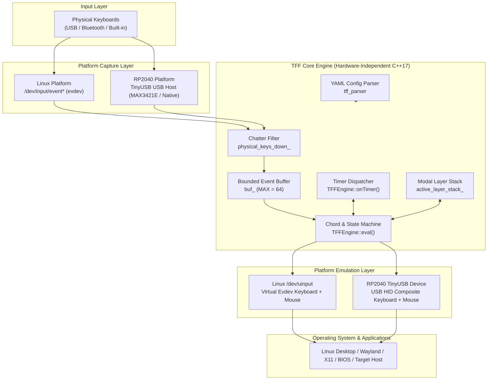
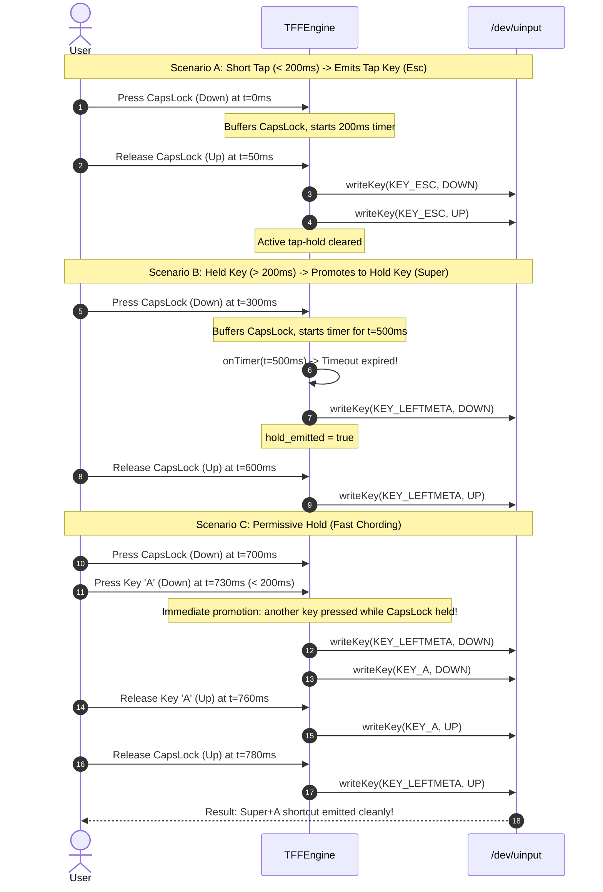
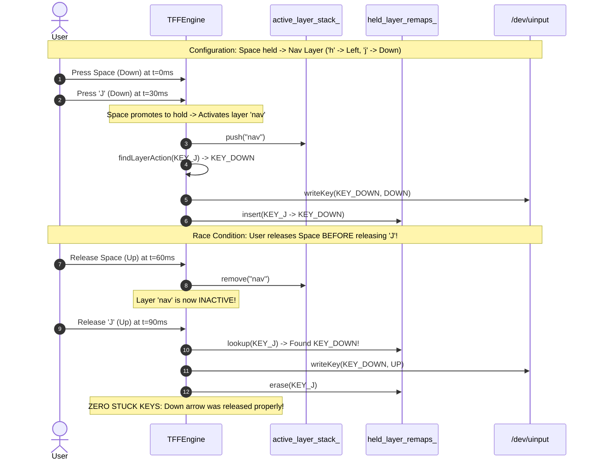
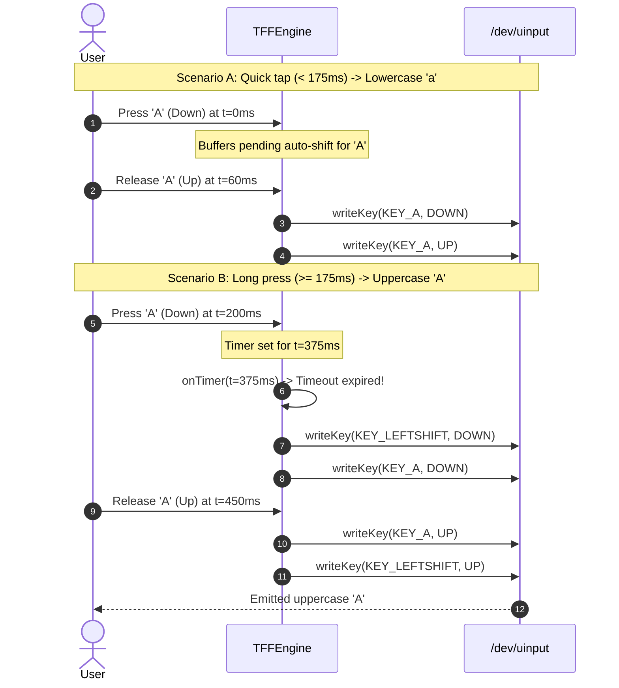

# Ten Flying Fingers (TFF) — System Architecture

This document provides an in-depth architectural breakdown of **Ten Flying Fingers (TFF)**, covering its multi-stage event processing pipeline, state machine invariants, cross-platform abstraction layer, and visual dataflow sequences.

---

## 1. High-Level System Architecture

TFF is architected around a strict separation between **Input Ingestion**, **Core Remapping Engine**, and **Virtual Output Emulation**. The core engine (`tff_core`) is 100% hardware-independent, standard C++17 with zero third-party dependencies, running identically on standard Linux PCs and embedded microcontrollers (Raspberry Pi RP2040).



---

## 2. Core Subsystems

### 2.1 Configuration & Parser Subsystem (`tff_parser`)
- **Format Flexibility**: Parses both compact dictionary YAML (`f + j: esc`, `capslock: [esc, super, 200ms]`) and legacy list syntax (`- in: [f, j]`, `out: esc`).
- **Symmetric Chording Permutations**: Combos declared with `+` (`d + f + j: tab`) automatically generate all $N!$ arrival permutations (`std::next_permutation`) at parse time, ensuring order-independent activation.
- **Literal Punctuation & Friendly Aliases**: Translates symbols (`;`, `,`, `.`, `/`, `\`, `-`, `=`) and modifier names (`ctrl`, `shift`, `alt`, `super`, `win`) directly to Linux evdev / HID keycodes.
- **Embedded Zero-Heap Parser**: Implements custom lightweight string splitting and comment stripping without external dependencies like `libyaml`.

### 2.2 Core Remapping Engine (`TFFEngine`)
- **State Machine**: Maintains active chords, held layer remaps, tap-hold timers, auto-shift pending keystrokes, and sequential leader keys.
- **Bounded Buffer**: Enforces a strict upper bound of `MAX_BUFFER_SIZE = 64` events in `buf_`. If an input source floods unresolved events without matching a combo, the oldest event is deterministically evicted via FIFO ordering, preventing memory exhaustion on RAM-constrained microcontrollers (e.g. RP2040 with 264 KB SRAM).
- **Hardware Switch Chatter Suppression**: Tracks physical key states via `physical_keys_down_`, discarding duplicate down events and spurious up events before they enter chord evaluation.
- **Timer Coordination**: The engine is purely reactive and does not spawn background threads. It reports pending timer expirations via `hasActiveTimer()` and `getActiveTimerTime()`, allowing the platform event loop to sleep precisely until the next timeout.

### 2.3 Platform Abstraction Layer
- **`LinuxPlatform`**:
  - Uses `poll()` to multiplex multiple input keyboards, timer fds (`timerfd_create`), and inotify configuration change watches.
  - Automatically discovers persistent keyboard symlinks in `/dev/input/by-id/`.
  - Supports exclusive keyboard grabbing (`ioctl(EVIOCGRAB, 1)`) so physical events are hidden from the OS while remapped events are emitted through `/dev/uinput`.
  - Dynamically detects keyboard hotplugging via inotify monitoring on `/dev/input`.
- **`RP2040Platform`**:
  - Direct hardware USB-to-USB passthrough device (hardware dongle).
  - Operates TinyUSB USB Host (reading physical keyboard) and USB Device (emulating keyboard + mouse to host PC) concurrently on Raspberry Pi Pico.

---

## 3. Detailed Dataflow & Sequence Diagrams

### 3.1 Direct Pass-Through Pipeline (Normal Typing)

When a key that does not belong to any chord candidate or special feature is pressed and released:

```mermaid
sequenceDiagram
    autonumber
    actor User
    participant Driver as Linux evdev / TinyUSB
    participant Engine as TFFEngine
    participant Buffer as Engine Bounded Buffer
    participant Virtual as /dev/uinput / USB Device

    User->>Driver: Press Key 'A' (Down)
    Driver->>Engine: processEvent(KEY_A, DOWN)
    Engine->>Buffer: push_back(KEY_A, DOWN)
    Engine->>Engine: eval() -> No candidate match
    Note over Engine,Buffer: Single down buffered; waits for next event or timer
    User->>Driver: Release Key 'A' (Up)
    Driver->>Engine: processEvent(KEY_A, UP)
    Engine->>Buffer: push_back(KEY_A, UP)
    Engine->>Engine: eval() -> Matches single-char down-up fast path
    Engine->>Virtual: writeKey(KEY_A, DOWN)
    Engine->>Virtual: writeKey(KEY_A, UP)
    Engine->>Buffer: clear()
    Virtual-->>User: OS receives 'a'
```

---

### 3.2 Order-Independent Chording & Key Swallowing

When two or more keys are pressed simultaneously to trigger a combo (e.g. `f + j -> esc`):

```mermaid
sequenceDiagram
    autonumber
    actor User
    participant Driver as Linux evdev
    participant Engine as TFFEngine
    participant Virtual as /dev/uinput

    User->>Driver: Press 'F' (Down) at t=0ms
    Driver->>Engine: processEvent(KEY_F, DOWN)
    Note over Engine: KEY_F buffered; matches prefix of 'f + j'
    User->>Driver: Press 'J' (Down) at t=15ms
    Driver->>Engine: processEvent(KEY_J, DOWN)
    Note over Engine: Both down seen; age < min_age (140ms)
    
    rect rgb(240, 248, 255)
        Note over Engine: Timer ticks or age satisfies min_age
        Engine->>Engine: evalCombo() -> AllDownKeysSeen
        Engine->>Virtual: writeComboDownKeys([KEY_ESC]) -> ESC DOWN
        Engine->>Engine: Record combo in down_keys_written_
    end

    User->>Driver: Release 'J' (Up) at t=180ms
    Driver->>Engine: processEvent(KEY_J, UP)
    Engine->>Engine: eval() -> WriteUpKeys
    Engine->>Virtual: writeComboUpKeys([KEY_ESC]) -> ESC UP
    Note over Engine: J is marked in swallow_keys_ (swallowed)
    Note over Engine: F was not yet seen up -> added to swallow_keys_

    User->>Driver: Release 'F' (Up) at t=210ms
    Driver->>Engine: processEvent(KEY_F, UP)
    Engine->>Engine: eval() -> Key 'F' matched in swallow_keys_
    Note over Engine: F UP is completely swallowed, NOT emitted to OS!
    Virtual-->>User: OS received pure Esc press and release
```

---

### 3.3 Tap-vs-Hold Permissive Chording & Timer Expiration

Dual-role keys (e.g. `capslock: [esc, super, 200ms]`) choose between a short tap and a held modifier:



---

### 3.4 Modal Layers & Out-of-Order Release Invariant

Modal layers allow momentary or toggled layer activation. A major edge case is **Out-of-Order Key Release**, where the user releases the layer activation key *before* releasing the remapped key:



---

### 3.5 Auto-Shift (Long-Press Capitalization)

Auto-Shift capitalization without chord combos:



---

### 3.6 Sequential Leader Key Sequences

Leader keys allow non-simultaneous vim-style sequential shortcuts (e.g. `Leader` followed by `w` followed by `q`):

```mermaid
sequenceDiagram
    autonumber
    actor User
    participant Engine as TFFEngine
    participant Virtual as /dev/uinput

    User->>Engine: Tap Leader Key (e.g. CapsLock or Ctrl)
    Note over Engine: leader_active_ = true; starts 1000ms inactivity timer
    User->>Engine: Tap 'W' at t=200ms
    Note over Engine: Matches prefix [W]; resets 1000ms inactivity timer
    User->>Engine: Tap 'Q' at t=400ms
    Note over Engine: Exact match [W, Q] -> Trigger macro!
    Engine->>Virtual: emitText(":wq\n")
    Note over Engine: leader_active_ = false; buffer cleared
```

---

## 4. Architectural Invariants & Resilience Guarantees

| Invariant | Implementation Mechanism | Verification Test |
|---|---|---|
| **Zero-Stuck-Key Invariant** | Every emitted virtual `DOWN` event is recorded. `reset()`, `finish()`, and `writeComboUpKeys()` strictly emit matching `UP` events in reverse order (`rbegin()` to `rend()`). `held_layer_remaps_` guarantees remapped releases even after layers deactivate. | `test_invariant_single_keys`, `test_invariant_combos_all_permutations`, `test_invariant_modal_layers_race_conditions`, `test_invariant_reset_and_finish` |
| **Bounded Buffer Invariant** | `buf_` is strictly capped at `MAX_BUFFER_SIZE = 64` events. When buffer size reaches 64, `evictOldestBufferedEvent()` evicts and emits the oldest event via FIFO order. | `test_invariant_bounded_buffer` |
| **Switch Chatter Suppression** | `physical_keys_down_` filters out duplicate physical down events and spurious up events for keys not held down, suppressing hardware contact bounce. | `test_invariant_corrupted_and_extreme_inputs` |
| **Zero Spurious Up Events** | No virtual `UP` event is ever emitted unless that key was previously held down in the virtual device. | `TrackingEventWriter::assertZeroStuckKeys` across all 11 invariant tests |
| **Lock-Free Single-Threaded Pipeline** | Core engine requires zero mutexes or synchronization primitives. Platform event loop handles I/O multiplexing and dispatches events sequentially. | Complete test suite passing under ThreadSanitizer / ASan |
| **Memory Bounds on RP2040** | Total static + dynamic engine footprint is < 16 KB RAM, easily fitting inside RP2040 SRAM (264 KB) with zero heap fragmentation during runtime event processing. | `test_rp2040_platform`, RP2040 CI cross-compilation |

---

## 5. Platform Architecture Comparison

| Feature | Linux (`LinuxPlatform`) | RP2040 Embedded (`RP2040Platform`) |
|---|---|---|
| **Execution Environment** | Linux Userspace Daemon | Bare-Metal C++ on ARM Cortex-M0+ |
| **Input Source** | `/dev/input/event*` via kernel evdev | TinyUSB USB Host (MAX3421E SPI / Native) |
| **Output Sink** | `/dev/uinput` virtual device node | TinyUSB USB Device HID Composite |
| **Keyboard Grabbing** | Exclusive via `ioctl(fd, EVIOCGRAB, 1)` | Physical hardware wire interception |
| **Hotplug Detection** | Linux `inotify` monitoring `/dev/input` | USB Host bus connection/disconnection interrupts |
| **Configuration Reload** | `SIGHUP` signal / inotify file watch | Flash storage / USB CDC serial commands |
| **Event Multiplexing** | `poll()` on event fds, timer fds, inotify | `tuh_task()` & `tud_task()` event loops |
